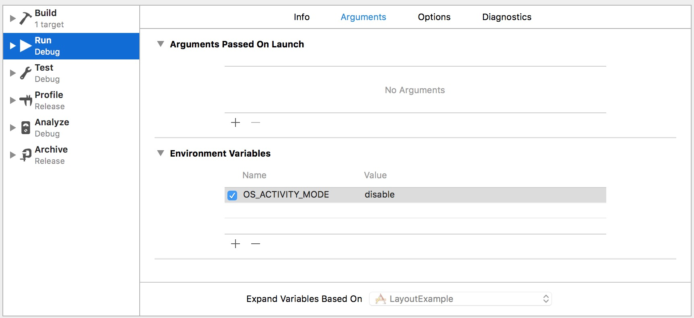
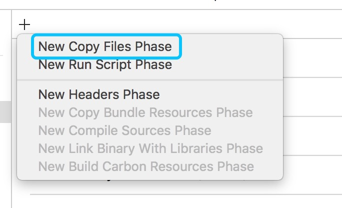
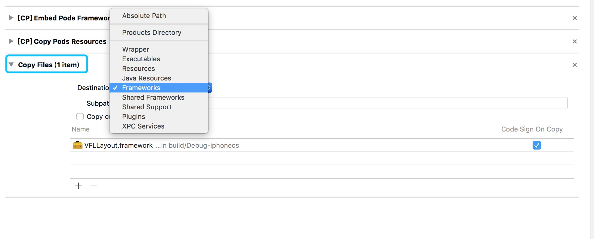

# Tiny & Powerful VFL

`AUUVFLLayout`是一个封装了Apple的`Visual Format Language`实现的一个自动布局的库。

`VFL`是一个简单而又强大的描述性语言，由于`VFL`是使用字符串来描述组件间的关系，而字符串又有着天然的不确定性，所以才导致了VFL使用频率的低下。正由于此，同样是受于这种痛点，才萌生了做一个友好的封装的念头。

## 关于使用

使用的方式跟`VFL`语言类似，同样的是以一种级联的方式描述一列视图的关系，用描述的方式来进行页面的布局。

详细的使用可以看[使用说明](./Using/Using_v01.md)，或者看代码里的注释说明。

## 更新历史

1. 取消了之前封装的一些`NSLayoutConstraint`布局方法
2. 封装VFL语法
3. 调整测试例子
4. 增加`UIView`的命名空间的兼容性，可以不用其命名空间即可使用
5. 重新设置实现方式

## 几个使用错误

* `[App] if we're in the real pre-commit handler we can't actually add any new fences due `

这个问题是在APP运行的时候出现的，添加一个属性即可，即 `OS_ACTIVITY_MODE : disable` ：

* `image not found`

这个问题是无法使用自己的`Framework`，添加进去以后运行不起来，可以打开工程文件的`Build Phases`，然后添加一个项目：

然后下面会出现一个`Copy Fiels`，在`Destination`项选择`Frameworks`，然后添加进自己出现问题的`Framework`，然后即可完美运行。

## 期望

能做到跟`VFL`原生接近的简洁写法体验。
