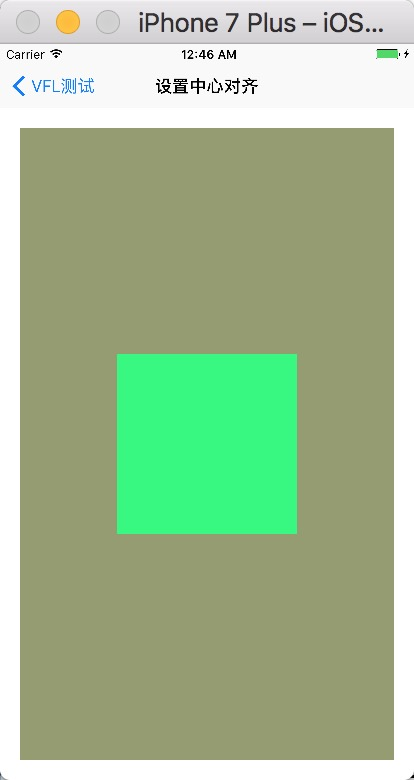
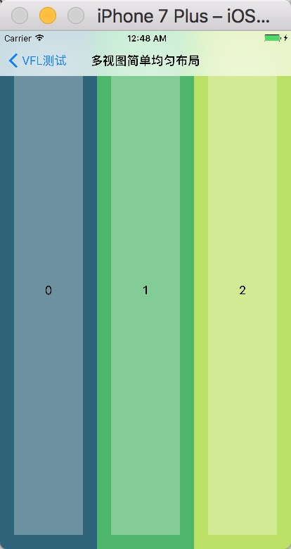
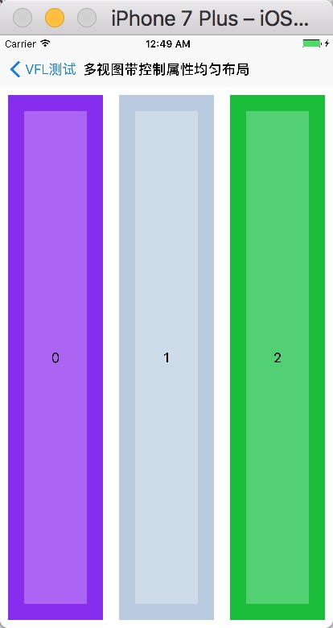
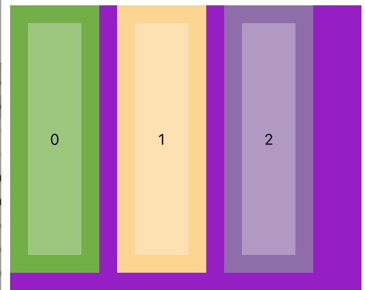
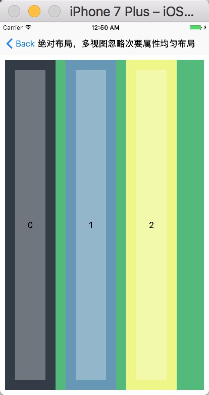

### 1 简单的开始

这个库主要使用`VFL`，辅助使用`NSLayoutConstraint`来实现的，写起来跟VFL的流程类似，只不过`VFL`是纯字符串的写法，而这里封装了后，对`VFL`的流程加强了一下，就可以使用面向对象的方式来写自动布局的方式。

所有的单独的属性设置都必须以`V`、`H`开始，跟`VFL`里的写法一个样，表示同一纬度的布局开始，`V`表示纵向布局的开始，`H`表示横向布局的开始，对于封装的方法的话，那就另当别论了，根据具体的封装方式来进行调用。

### 2 设置边距 

由于本库对于属性的设置是以`Property`的方式来实现的，所以每个单独的语句都可以在`get`以后收到一个布局的语句。

其中需要注意的有两个方法，

* `end` 以父视图的某一维度的边界结尾，比如右边或者底边。
* `endL` 直接以最后一个控件结尾，适用于设置指定宽度或者宽度范围的情况。

**再有一个就是设置视图的方法`nextTo`，用于设定在同一纬度上的视图。** 

下面有两个例子

- 单个的散列写法：

```objective-c
[H.interval(20).nextTo(view1).interval(20) end];
NSString *vfl = V.interval(84).nextTo(view1).interval(20).end;
NSLog(@"vfl : %@", vfl);
```


即可以通过OC的语法格式结尾，也可以在前面声明一个临时变量接取布局的语句。

比如第一条语句，表示的完整的布局的意思可以理解为`view1在横向方向上，距离其父视图的左边20像素，距离父视图的右边20个像素`，如下：

```
父视图的左边--20--view1--20--父视图的右边
```

- 封装好的一个方法：

```objective-c
NSArray *vfls = view2.edge(UIEdgeInsetsMake(40, 40, 40, 40));
NSLog(@"vfls %@", vfls);
```

### 3 指定宽高

宽高的设定，跟VFL里一个样，如：

```
[H.interval(10).nextTo(view1.lengthEqual(@100)) endL];
[V.interval(74).nextTo(view1.lengthIs(100)) endL];
```


这里有两个方法，一个是`lengthEqual`接收一个对象，如果是一个数值对象的话，那么就设定这个宽高为这个固定的值，如果是一个视图对象的话，就设定这两个视图的宽或高相等。

一个封装好的方法：

```
view4.fixedSize(100, 100);
```

### 4 相对位置

主要指的是多个视图间的关联，可以像一条链子一样在同一纬度穿起来，如：

```objective-c
[H.interval(10).nextTo(view1).interval(30).nextTo(view2.lengthIs(100)).interval(10) end];
[V.interval(74).nextTo(view2).interval(30).nextTo(view3.lengthIs(100)).interval(10) end];
[H.interval(10).nextTo(view4.lengthIs(100)).interval(30).nextTo(view3).interval(10) end];
[V.interval(74).nextTo(view1.lengthIs(100)).interval(30).nextTo(view4).interval(10) end];
```

级联视图间任然是以`interval`设置间距。


### 5 设置优先级

优先级是以`priority`方法设定的，表示的是可被压缩的优先级，这个优先级越高，就越先被压缩。

在使用的时候必须配合的设置一个指定的宽度值，作为可被压缩到的最小的宽高，否则会报错。

```objective-c
        [H.interval(10).nextTo(label1.priority(100).lengthIs(100)).interval(5).nextTo(label2.priority(200).lengthIs(100)).interval(10) end];
[H.interval(10).nextTo(label3.priority(200).lengthIs(100)).interval(5).nextTo(label4.priority(100).lengthIs(100)).interval(10) end];
[V.interval(100).nextTo(label1).interval(100).nextTo(label3) endL];
[V.interval(100).nextTo(label2).interval(100).nextTo(label4) endL];
```


### 6 设置宽高的范围

使用`between`方法设置，主要的作用是设置宽高在一定的范围。

```
[H.interval(20).nextTo(self.label.between(200, 300)) endL];
[V.nextTo(addButton).interval(30).nextTo(self.label) endL];
```

* 小于最小值


* 大于最大值


比如这个例子里，当`label`里的值过短的时候，`label`的宽度默认的会是其最小的宽度值，当内容过多的时候，`label`的的宽度就会被拉伸，当拉伸到最大的宽度的时候，就开始压缩文字换行了。

### 7 设置居中

在父视图上居中。

```
view1.edge(UIEdgeInsetsMake(84, 20, 20, 20));
view2.alignmentCenter().fixedSize(180, 180);
```



### 8 设置边界相对位置关系

主要是`UIView+AUUVFLEdge.h`里的方法，用于描述上下左右中心等的相对关系。

* 简单的使用

```
[H.interval(10).nextTo(view1.lengthIs(60)).nextTo(view2.lengthIs(80)).nextTo(view3.lengthIs(100)).nextTo(view4.lengthIs(120)) endL];
[V.interval(64).nextTo(view1.lengthIs(60)).nextTo(view2.lengthIs(80)).nextTo(view3.lengthIs(100)).nextTo(view4.lengthIs(120)) endL];
```


* 带比例的使用，复杂的写法

```
[H.interval(10).nextTo(view1.rightEqual(view2.rightEqual(view3.rightEqual(view4.widthEqual(view3.widthEqual(view2.widthEqual(view1.u_width.u_multiplier(1.5)).u_width.u_multiplier(1.5)).u_width.u_multiplier(1.5)).u_left).u_left).u_left)) endL];
[V.interval(74).nextTo(view1.bottomEqual(view2.bottomEqual(view3.bottomEqual(view4.heightEqual(view3.heightEqual(view2.heightEqual(view1.u_height.u_multiplier(1.5)).u_height.u_multiplier(1.5)).u_height.u_multiplier(1.5)).u_top).u_top).u_top)) endL];
```


### 9 多个视图的平均布局

这里就主要是封装的方法了，用于多个视图在父视图上进行平均的布局。

生成测试视图的方法

```
- (NSArray *)views {
    NSMutableArray *views = [[NSMutableArray alloc] init];
    for (NSInteger i = 0; i < 3; i ++) {
        UIView *view = [self generateViewWithTag:i inView:self.view];
        [views addObject:view];
    }
    return views;
}
```

* 简单的横向均匀布局

```
[self views].avgLayoutD(AUULayoutDirectionHorizontal);
```



* 带边界属性和间距的均匀布局

```
[self views].avgLayoutDEM(AUULayoutDirectionHorizontal, UIEdgeInsetsMake(74, 10, 10, 10), 20);
```



### 10 绝对均匀布局

就是在多视图布局的维度指定个子控件的平均布局时的宽高。

举个例子，假如是横向的均匀布局，那么在横向这一维度，宽度就是非空值，高度可空，如果高度不是有效的值比如`-1`的话，那么高度会在纵向填充满父视图

* 指定宽高均匀布局

```
[self viewsWithContainer:container].absHoriLayout(100, 300, 20);
```



* 忽略次要属性均匀布局

```
[self viewsWithContainer:container].absHoriLayout(100, -1, 20);
```

