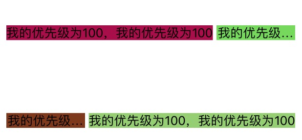
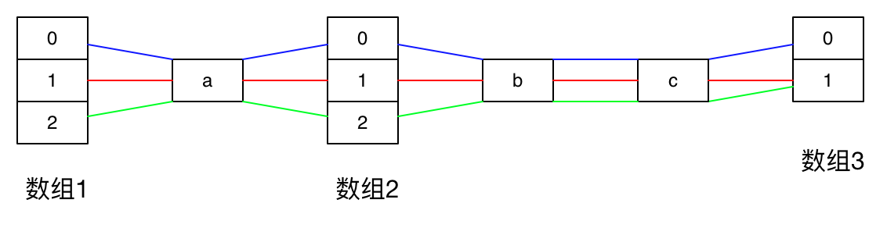

### 1 简单的开始

这个库主要使用`VFL`，写起来跟VFL的流程类似，只不过`VFL`是纯字符串的写法，而这里封装了后，对`VFL`的流程加强了一下，就可以使用面向对象的方式来写自动布局的方式。

所有的单独的属性设置都必须以`V`、`H`开始，跟`VFL`里的写法一个样，表示同一维度的布局开始，`V`表示纵向布局的开始，`H`表示横向布局的开始，对于封装的方法的话，那就另当别论了，根据具体的封装方式来进行调用。

为了更加的接近原生`VFL`语句的写法，这里也改了好几次了，由于OC没法做到运算符重载，最后只想到了使用系统为OC语言扩充的下标法来实现，对于熟悉`VFL`的人来说，看测试的代码，写起来还是有那么一些似曾相识的感觉的。于是乎，除了语句的结尾和一些特殊的语句外，其他的部分基本上都是下标取值的写法，就想字符串、字典的取值类似，如`array[0]、dict[@"key"]`类似。

### 2 设置边距 

由于本库对于属性的设置是以`Property`的方式来实现的，所以每个单独的语句都可以在`get`以后收到一个布局的语句。

其中需要注意的有两个方法，

* `end` 以父视图的某一维度的边界结尾，比如右边或者底边。
* `cut` 直接以最后一个控件结尾，适用于设置指定宽度或者宽度范围的情况。


下面有两个例子

- 单个的散列写法：

```objective-c
H[20][view1][20].end();
NSString *vfl = V[84][view1][20].end();
NSLog(@"vfl : %@", vfl);
```


即可以通过OC的语法格式结尾，也可以在前面声明一个临时变量接取布局的语句。

比如第一条语句，表示的完整的布局的意思可以理解为`view1在横向方向上，距离其父视图的左边20像素，距离父视图的右边20个像素`，如下：

```
父视图的左边--20--view1--20--父视图的右边
```

- 封装好的一个方法：

```objective-c
NSArray *vfls = view2.edge(UIEdgeInsetsMake(40, 40, 40, 40));
NSLog(@"vfls %@", vfls);
```

### 3 指定宽高

设置宽高都是在子`VFL`中对`UIView`设置，有三种具体宽高的设置方法：

* 设置一个整形的宽高：`view[20]`
* 设置一个浮点型的宽高：`view[@10.89]`，或者`view[@"23.12"]`，可以看出设置的是一个对象
* 设置宽高相等：`view1[view2]`

这里有设置宽度的方法，对于一个视图来说，可以直接设置宽高，比如 `view[20]`，如果之前的起始是`H`则表示的是宽度为20，如果之前的起始是`V`则表示的是高度为20。

这里有个设置好的宏`kUseVFLSubscriptLayout`，如果你也对`UIView`做了类似的扩充的话，可以在你`import` `AUUVFLLayout.h`之前设置一下`define kUseVFLSubscriptLayout 0`，即可注销这里的扩充。

在你取消了布局里的扩充以后，可以使用`UIView`的命名空间扩充来实现，如`view.VFL[20]`。

宽高的设定，跟VFL里一个样，如：

```
H[10][view1[100]].cut();
V[74][view1[100]].cut();

H[view2[100]][10].end();
V[74][view2[100]].cut();

H[view3[view1]][10].end();
V[view3[view1]][10].end();

H[10][view4[view1]].cut();
V[view4[view1]][10].end();
```


一个封装好的设置大小的方法：

```
view4.fixedSize(100, 100);
```

### 4 相对位置

主要指的是多个视图间的关联，可以像一条链子一样在同一纬度穿起来，如果设置的两个view间没有值如`[view1][view2]`，则表示两个视图间的间距为0，如果设置间距可以这样`[view1][20][view2]`，表示两个视图间的间距为20。如：

```objective-c
H[10][view1][30][view2[100]][10].end();
V[74][view2][30][view3[100]][10].end();
H[10][view4[100]][30][view3][10].end();
V[74][view1[100]][30][view4][10].end();
```


### 5 设置优先级

优先级是以`priority`方法设定的，表示的是可被压缩的优先级，在`VFL`中这个优先级越高，就越先被压缩。

在使用的时候必须配合的设置一个指定的宽度值，作为可被压缩到的最小的宽高，否则会报错。

```objective-c
H[10][label1[priority(100, 100)]][5][label2[priority(200, 100)]][10].end();
H[10][label3[priority(200, 100)]][5][label4[priority(100, 100)]][10].end();

V[100][label1][100][label3].cut();
V[100][label2][100][label4].cut();
```



### 6 设置宽高的范围

使用`between`方法设置，主要的作用是设置宽高在一定的范围。

```
H[20][self.label[between(200, 300)]].cut();
V[addButton][20][self.label].cut();
```

* 小于最小值时


* 大于最大值时


比如这个例子里，当`label`里的值过短的时候，`label`的宽度默认的会是其最小的宽度值，当内容过多的时候，`label`的的宽度就会被拉伸，当拉伸到最大的宽度的时候，就开始压缩文字换行了。

### 7 设置边界相对位置关系

```
H[10][view1[60]][view2[80]][view3[100]][view4[120]].cut();
V[64][view1[60]][view2[80]][view3[100]][view4[120]].cut();
```


## 8 设置两个视图的间距范围

这里有两个视图，设置了他们的左右间距的最大值和最小值后，在旋转屏幕的时候，总是会贴近设置了最小值的一方：

```
H[view1][greaterThan(50)][testView1[50]][lessThan(50)][view2].cut();
H[view1][lessThan(50)][testView2[50]][greaterThan(50)][view2].cut();
V[100][testView1[50]][50][testView2[50]].cut();
```

* 竖屏时


* 横屏时


修改一下`case3`的代码，将两个视图的间距拼接进去，刚好：

```
H[10][view1[100]][greaterThan(100)][view2[100]][10].end();
H[10][view4[100]][greaterThan(100)][view3[100]][10].end();
V[74][view1[100]][greaterThan(100)][view4[100]][10].end();
V[74][view2[100]][greaterThan(100)][view3[100]][10].end();
```

## 9 属性的批量操作

回到`case3`，布局写了8行有效代码，使用`case8`的方法用了4行，下面来看看使用数组来解决。

先来一个简单的合并：

```
H[view3[view1]][10].end();
V[view3[view1]][10].end();
```

这里可以看出，其中主要不一样的部分在于开头，一个是`H`，一个是`V`，那么提取合并一下：

```
@[H,V].VFL[view3[view1]][10].end();
```

可以看出，合并的语句是以一个数组开头的，对于数组紧接着就是一个VFL的命名空间类似的写法，因为这个自动布局的库主要是以下标法来实现的，而对于数组系统已经为其实现了下标法，所以为了避免冲突，就添加了这个只读的属性作为延续的开始。

**Warning  批量操作的数组后必须调用其 `VFL` 属性**

合并之后的写法，出了数组的区别外，其他的都是两个语句的共同部分。

然后再看另一个例子：

```
H[10][view1[100]].cut();
V[74][view1[100]].cut();
```

这里可以看出有两个不同的地方，一个是开头的`H`、`V`，一个是紧接着的边距10、74，那么提取合并一下：

```
@[H,V].VFL[@[@10,@74]][view1[100]].cut();
```

这里提取了不同的地方，合并了相同的地方。

先再看一下`case8`中初步合并后的代码：

```
@[H,H].VFL[10][@[view1,view4][100]][greaterThan(100)][@[view2,view3][100]][10].end();
@[V,V].VFL[74][@[view1,view2][100]][greaterThan(100)][@[view4,view3][100]][10].end();
```

最终的合并，是有一些不好看。。。：

```
@[H,H,V,V].VFL[@[@10, @10, @74, @74]][@[view1, view4,view1,view2].VFL[100]][greaterThan(100)][@[view2,view3,view4,view3].VFL[100]][10].end();
```

好了，可以说一下合并的思路了。。。

说白了，就是把相同的地方合并，把不同的地方提取出来放到一个数组中去，如下图：



从图中可以看到，从前往后，按照数组的下表挨个匹配，如果后面的数组元素个数没前面的多，那么默认的取最后一个元素补齐。

上图简单示意如下(分开一点写，便于观看)：

```
@[0,1,2]  [a]  @[0,1,2]  [b]  [c]  @[0,1];
```

结束布局以后的，出现的结果如下：

```
0a0bc0
1a1bc1
2a2bc1	// 由于之前的数组有三个元素，最后一个却只有两个，于是取其最后一个元素补进去。
```

